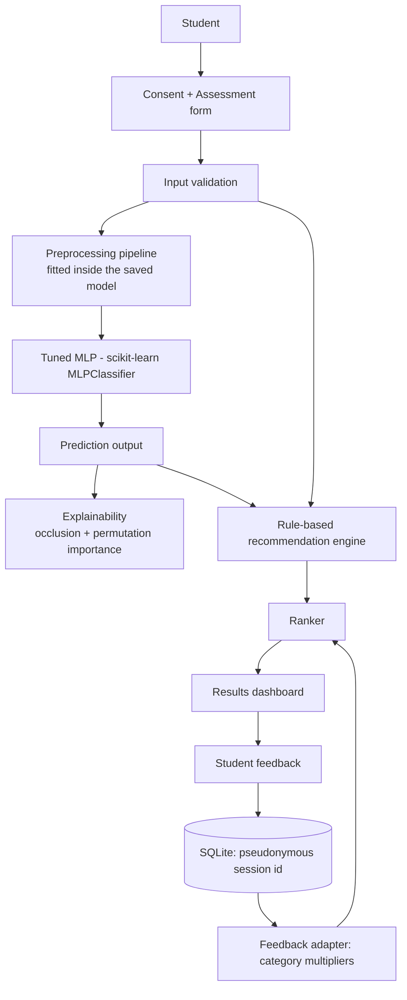

# System architecture

```mermaid
flowchart TD
  S[Student] --> C[Consent + Assessment form]
  C --> V[Input validation]
  V --> P[Preprocessing pipeline<br/>fitted inside the saved model]
  P --> M[Tuned MLP - scikit-learn MLPClassifier]
  M --> O[Prediction output]
  O --> X[Explainability<br/>occlusion + permutation importance]
  V --> R[Rule-based recommendation engine]
  O --> R
  R --> K[Ranker]
  K --> D[Results dashboard]
  D --> F[Student feedback]
  F --> DB[(SQLite: pseudonymous session id)]
  DB --> A[Feedback adapter: category multipliers]
  A --> K
```
Feedback only re-ranks recommendations; it never retrains the prediction model.
